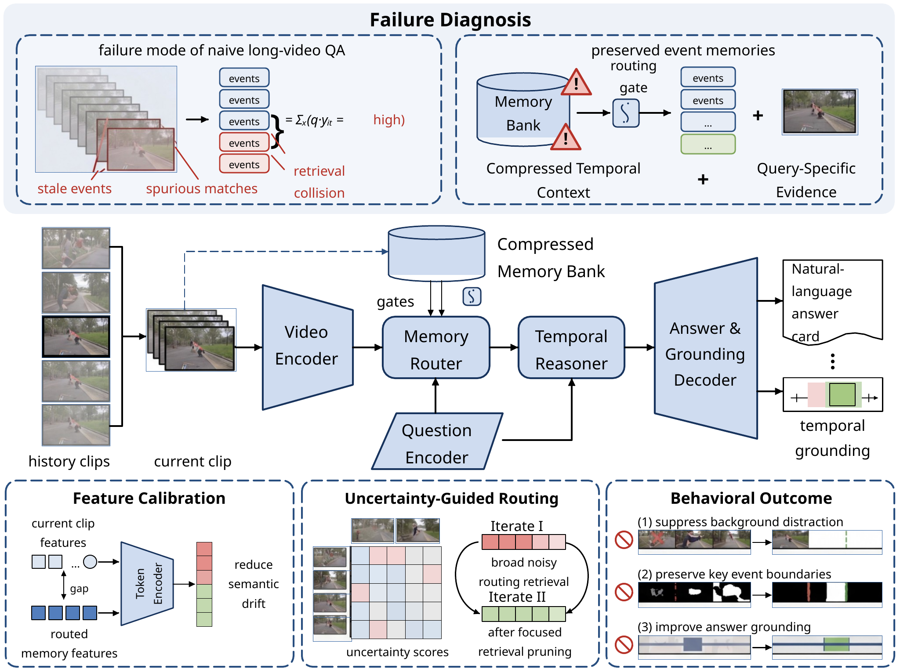
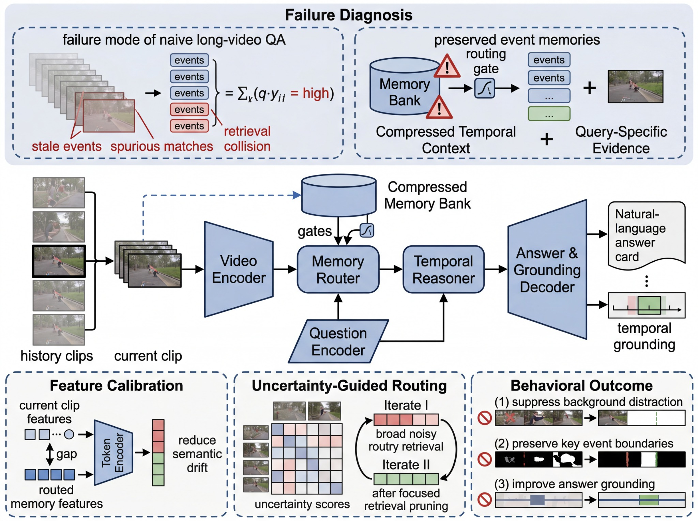

<div align="center">

# VSDX Trace

**Turn raster diagrams into high-fidelity, independently editable Microsoft Visio files.**

[](https://github.com/ZJUZhiyuCai/vsdx-trace/actions/workflows/ci.yml)
[](https://github.com/ZJUZhiyuCai/vsdx-trace/actions/workflows/codeql.yml)
[](https://github.com/ZJUZhiyuCai/vsdx-trace/releases)
[](LICENSE)

[English](README.md) · [简体中文](README.zh-CN.md)

</div>

VSDX Trace is an Agent Skill and Python toolchain for reconstructing screenshots,
scientific figures, architecture diagrams, and flowcharts as native `.vsdx`
documents. Text, panels, arrows, nodes, and other diagram primitives remain
selectable and editable. Raster content is kept only where vector reconstruction
is not reasonable.

<!-- repo-only:start -->


<p align="center"><strong>Rendered editable-VSDX reconstruction</strong></p>

<details>
<summary><strong>See the reference → reconstruction comparison</strong></summary>

| Reference image | Rendered editable VSDX |
| --- | --- |
|  |  |

</details>

<p align="center">
  <a href="assets/marketing/vsdx-trace-poster-3x4.png">Download the 3:4 promotional poster</a>
</p>
<!-- repo-only:end -->

## Why VSDX Trace

| Requirement | Project guarantee |
| --- | --- |
| Editability | Main-page text and diagram primitives are native Visio shapes. |
| Fidelity | Source pixels are the layout truth; render-and-compare loops expose drift. |
| Reliability | Every delivery can be structurally validated as an OPC/VSDX package. |
| Transparency | Reports distinguish structural, compatible-renderer, and real Visio testing. |
| Privacy | User references are private by default and enter public marketing only with explicit authorization; installable archives remain sanitized. |

> [!IMPORTANT]
> A full-page screenshot may look identical but is not an editable reconstruction.
> VSDX Trace permits the complete source image only on a separate reference page.

## Quick start

### Install as a Codex skill

```bash
git clone https://github.com/ZJUZhiyuCai/vsdx-trace.git \
  ~/.codex/skills/vsdx-trace
```

The skill becomes discoverable on the next Codex turn. Other Agent
Skills-compatible clients can install the repository as a skill folder containing
`SKILL.md`.

### Invoke

Upload a clear reference image and ask:

> Use $vsdx-trace to reconstruct this image as a high-fidelity, editable VSDX file.

The default delivery contains:

- an editable `.vsdx` file;
- a first-page PNG preview;
- a structural validation report;
- a separate original-reference page when requested.

## How it works

1. Decompose the source into layout, panels, flow, text, micro-elements, and irreducible raster regions.
2. Record geometry in source-image pixel coordinates.
3. Generate native Visio shapes and semantic names directly into the VSDX package.
4. Validate relationships, page parts, shape IDs, and embedded media.
5. Render with LibreOffice and Poppler, compare against the reference, and iterate on the largest errors.

The scene format and supported primitives are documented in
[`references/SCENE_SCHEMA.md`](references/SCENE_SCHEMA.md).

## Local toolchain

Requirements:

- Python 3.10+
- Pillow 10+
- NumPy 1.26+
- lxml 5–6
- optional LibreOffice and Poppler for headless rendering QA

Microsoft Visio is not required to construct a VSDX.

```bash
python -m pip install -r requirements.txt
mkdir -p work

python scripts/build_from_scene.py \
  assets/templates/scene-template.json \
  work/example.vsdx \
  --manifest work/example.manifest.json

python scripts/validate_vsdx.py \
  work/example.vsdx \
  --output work/example.validation.json
```

With LibreOffice and Poppler installed:

```bash
python scripts/render_vsdx.py \
  work/example.vsdx work/rendered \
  --dpi 100 --first-page-only
```

<!-- full-only:start -->
## Reproducible benchmark

The bundled Synthetic Event Routing benchmark contains no user-provided material.
It exercises custom arrows, cylinders, decoders, matrices, warning symbols,
editable text, and local raster fragments.

| Metric | Recorded result |
| --- | ---: |
| Editable main-page shapes | 269 |
| Editable text shapes | 54 |
| Local bitmap shapes | 19 |
| Pixel similarity | 0.9485 |
| Edge F1, 1 px tolerance | 0.8388 |
| Diagnostic score | 0.9171 |

Rebuild it with:

```bash
python examples/synthetic_event_routing_case.py \
  --work-dir work/benchmark \
  --output work/benchmark/rebuilt.vsdx
```

See [`references/GOLD_STANDARD.md`](references/GOLD_STANDARD.md) for the full
test contract and reproducibility caveat.
<!-- full-only:end -->

## Project structure

```text
SKILL.md            Agent instructions and quality contract
agents/             Product-facing skill metadata
scripts/            VSDX build, validation, render, compare, and privacy tools
references/         Scene schema, playbook, OOXML notes, rubric, troubleshooting
assets/templates/   Reusable scene starter
<!-- repo-only:start -->
assets/marketing/   Repository-only public showcase assets
<!-- repo-only:end -->
<!-- full-only:start -->
assets/gold/        Privacy-safe synthetic benchmark
<!-- full-only:end -->
examples/           Runnable end-to-end examples
evals/              Skill behavior evaluations
tests/              Deterministic pipeline tests
```

## Contributing and security

- Read [`CONTRIBUTING.md`](CONTRIBUTING.md) before opening a pull request.
- Use [GitHub Discussions](https://github.com/ZJUZhiyuCai/vsdx-trace/discussions) for usage questions.
- Report vulnerabilities privately according to [`SECURITY.md`](SECURITY.md).
- Never submit private reference images, task-specific crops, local paths, or user identifiers.

## Reproducibility note

VSDX XML, relationships, metadata, timestamps, and decoded image pixels are
reproducible. Lossless PNG byte streams can differ across Pillow or zlib versions
while decoding to identical pixels.

## License and trademarks

Released under the [MIT License](LICENSE). See [NOTICE.md](NOTICE.md) for
trademark and benchmark-asset notices.

VSDX Trace is an independent community project and is not affiliated with or
endorsed by Microsoft or OpenAI.
