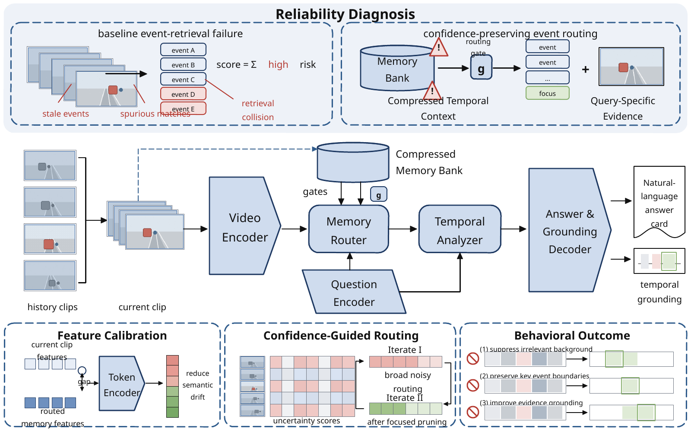

<div align="center">

# VSDX Trace

**把栅格参考图高保真复刻成逐元素可编辑的 Microsoft Visio 文件。**

[](https://github.com/ZJUZhiyuCai/vsdx-trace/actions/workflows/ci.yml)
[](https://github.com/ZJUZhiyuCai/vsdx-trace/actions/workflows/codeql.yml)
[](https://github.com/ZJUZhiyuCai/vsdx-trace/releases)
[](LICENSE)

[English](README.md) · [简体中文](README.zh-CN.md)

</div>

VSDX Trace 是一套 Agent Skill 与 Python 工具链，用于把截图、论文插图、
系统架构图和流程图复刻成原生 `.vsdx` 文档。标题、说明、面板、箭头、节点、
token 等元素保持可选择、可编辑；只有照片、显微图、热图等不适合矢量化的内容
才保留为局部位图。

<!-- full-only:start -->

<!-- full-only:end -->

## 核心保证

| 要求 | 项目保证 |
| --- | --- |
| 可编辑 | 主页面文字和图形采用原生 Visio 形状。 |
| 高保真 | 以原图像素坐标为唯一布局真值，通过渲染对比持续校准。 |
| 可靠 | 验证 VSDX/OPC 结构、页面关系、Shape ID 和嵌入媒体。 |
| 诚实 | 明确区分结构验证、兼容渲染验证和 Visio 实机验证。 |
| 隐私 | 用户参考图和任务专用素材默认不会进入公共案例或发布包。 |

> [!IMPORTANT]
> 把完整截图放在主页面上虽然看起来一致，但不属于可编辑复刻。
> 完整原图只允许出现在独立的对照页。

## 安装

```bash
git clone https://github.com/ZJUZhiyuCai/vsdx-trace.git \
  ~/.codex/skills/vsdx-trace
```

下一个 Codex 对话回合即可自动发现。其他兼容 Agent Skills 的客户端，也可以把
仓库作为包含 `SKILL.md` 的 skill 目录安装。

## 使用

上传清晰参考图后输入：

> 使用 $vsdx-trace，把这张图高保真复刻成可编辑的 VSDX 文件。

默认交付内容包括：

- 可编辑 `.vsdx` 文件；
- 第一页 PNG 预览；
- 结构验证报告；
- 按需加入的独立原图对照页。

## 工作流程

1. 将原图拆成页面布局、面板、流程、文字、微结构和必要的局部位图。
2. 用原图像素坐标记录几何位置。
3. 直接生成带语义名称的原生 Visio 形状。
4. 验证页面部件、关系、Shape ID 和媒体资源。
5. 使用 LibreOffice 与 Poppler 渲染，结合叠加图和差异图迭代。

场景格式与图元说明见
[`references/SCENE_SCHEMA.md`](references/SCENE_SCHEMA.md)。

## 本地验证

```bash
python -m pip install -r requirements.txt
mkdir -p work

python scripts/build_from_scene.py \
  assets/templates/scene-template.json \
  work/example.vsdx \
  --manifest work/example.manifest.json

python scripts/validate_vsdx.py \
  work/example.vsdx \
  --output work/example.validation.json
```

安装 LibreOffice 与 Poppler 后可以执行无头渲染：

```bash
python scripts/render_vsdx.py \
  work/example.vsdx work/rendered \
  --dpi 100 --first-page-only
```

<!-- full-only:start -->
## 合成基准

仓库附带完全由程序生成的 Synthetic Event Routing Gold Standard，不包含任何
用户原图。当前记录为 269 个主页面形状、54 个文本形状、19 个局部位图；像素
相似度约 0.9485，1 px 容差下的边缘 F1 约 0.8388。

```bash
python examples/synthetic_event_routing_case.py \
  --work-dir work/benchmark \
  --output work/benchmark/rebuilt.vsdx
```

不同 Pillow/zlib 版本可能产生不同的无损 PNG 压缩字节，但解码像素、VSDX XML、
关系、元数据与时间戳应保持一致。
<!-- full-only:end -->

## 参与项目

- 提交代码前请阅读 [`CONTRIBUTING.md`](CONTRIBUTING.md)。
- 使用问题请前往 [GitHub Discussions](https://github.com/ZJUZhiyuCai/vsdx-trace/discussions)。
- 安全问题请按 [`SECURITY.md`](SECURITY.md) 私下报告。
- 禁止提交用户私有参考图、任务专用裁剪、本地路径或身份标识。

## 许可证与商标

项目采用 [MIT License](LICENSE)。商标及合成素材说明见 [NOTICE.md](NOTICE.md)。

VSDX Trace 是独立社区项目，与 Microsoft 或 OpenAI 不存在隶属或背书关系。
